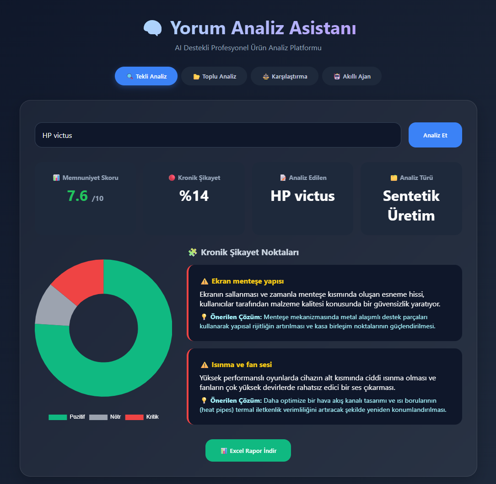
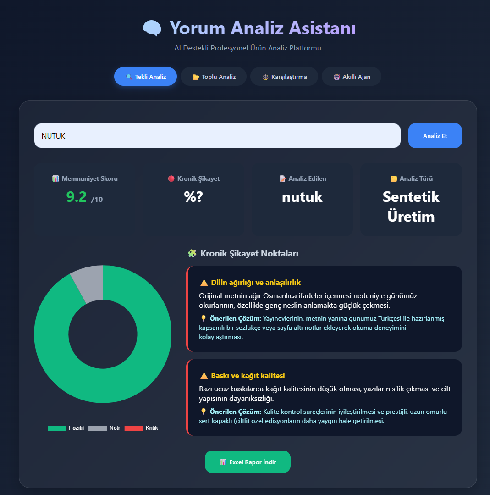
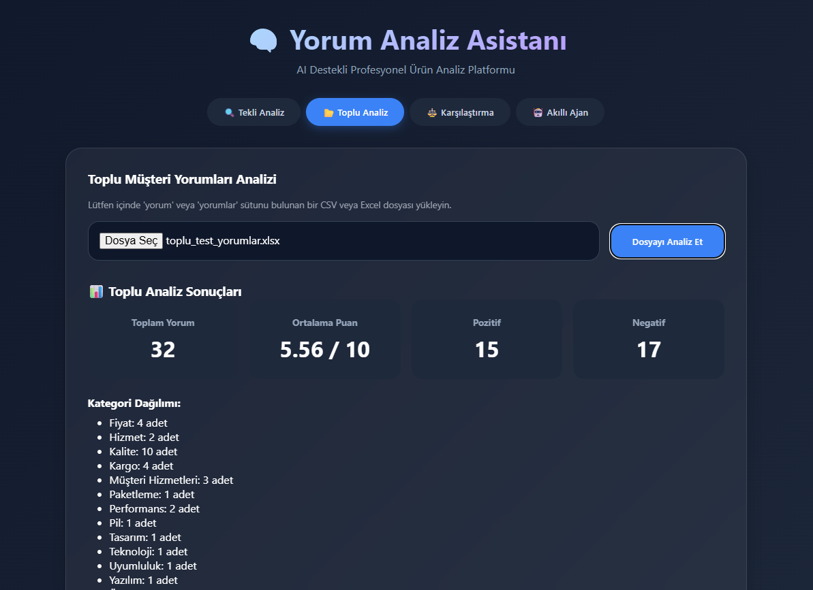
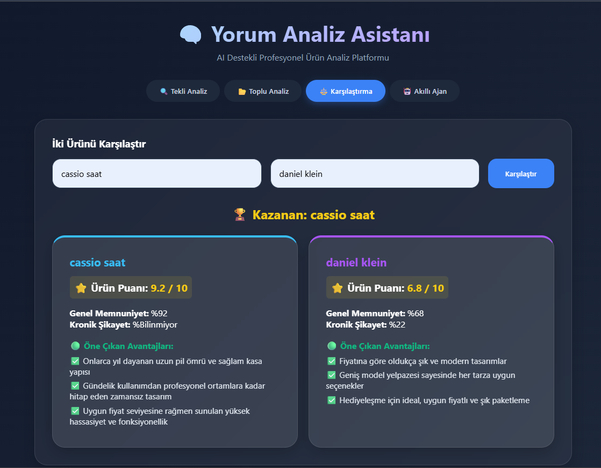
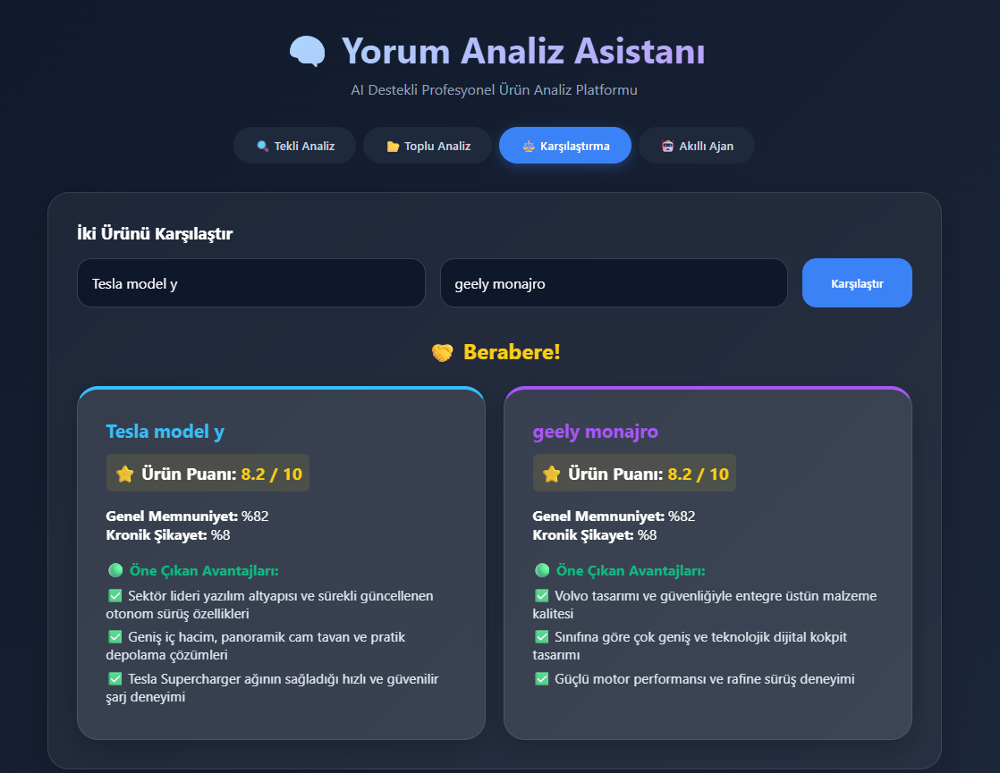
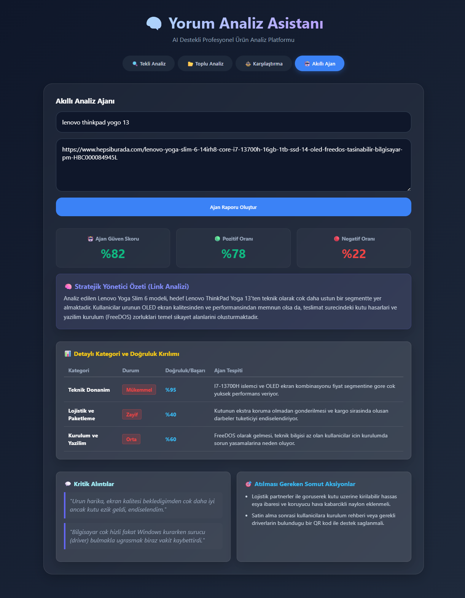

# 🧠 Yorum Analiz Asistanı

> Yapay zeka destekli e-ticaret yorum analiz platformu — duygu dağılımı, yönetici özetleri ve ürün karşılaştırma tek çatı altında.


---

## 👥 Geliştirici Ekibi

| İsim |
|---|
| Recep Doruk |
| Muhammed Emin Uysal |
| Arif Kemal Şeremet |

---

## 📸 Ekran Görüntüleri












---

## 🚀 Özellikler

- **Tekli Analiz** — Bir ürün adı girerek o ürün hakkında internetteki genel kanıyı sentetik olarak analiz eder. Kronik şikayetler tespit edilir, her sorun için özel Gemini promptu ile eşsiz çözüm önerileri üretilir.
- **Toplu Analiz** — Yüklenen CSV veya Excel dosyasındaki yorumları duygu, kategori ve puan bağlamında değerlendirir. `temperature=0.1` ile deterministik, güvenilir sonuçlar garantilenir.
- **Karşılaştırma** — İki farklı ürünün analiz sonuçlarını yan yana getirir. AI + sayısal metrik kombinasyonuyla hangi ürünün nerede öne çıktığını derinlemesine açıklar.
- **Akıllı Ajan** — Manuel girilen yorum setleri veya link aracılığıyla yönetici özeti ve uygulanabilir aksiyon planı çıkarır.
- **Dışa Aktarma** — Analiz sonuçlarını **Excel** formatında indirir; çıktı doğrudan Toplu Analiz modülüne girdi olarak kullanılabilir.

---

## 📁 Proje Mimarisi

<details>
<summary><b>📂 Klasör yapısını görmek için tıklayın</b></summary>

```
📁 YorumAnalizatoru/                   ← Ana Kök Dizin (Repository Root)
│
├── 📁 backend/                        ← Sunucu ve AI Mantığı
│   ├── 📁 __pycache__/                ← Python derleme dosyaları (otomatik oluşur)
│   ├── 📄 app.py                      ← Flask API rotaları, yönlendirmeler ve CORS ayarları
│   ├── 📄 analiz_engine.py            ← Gemini API entegrasyonu ve Excel rapor motoru
│   └── 📄 requirements.txt            ← Python kütüphane bağımlılık listesi
│
├── 📁 frontend/                       ← Kullanıcı Arayüzü
│   ├── 📄 index.html                  ← Sitenin iskeleti ve sekmeli arayüz yapısı
│   ├── 📄 script.js                   ← API istekleri, Enter UX desteği, grafik çizimleri
│   └── 📄 style.css                   ← Modern karanlık tema (Dark Mode) görsel tasarımı
│
├── 📄 .env                            ← ⚠️ KRİTİK: Gizli API anahtarınız buraya yazılır
│                                         (GitHub'a gönderilmez, kendiniz oluşturmanız gerekir)
├── 📄 .gitignore                      ← .env ve __pycache__ gibi dosyaların sızmasını engeller
└── 📄 README.md                       ← Bu dosya
```

> **💡 `.env` dosyası nereye?** Yukarıdaki yapıda gördüğünüz gibi `.env` dosyası en dışta, `backend/` ve `frontend/` klasörleriyle aynı seviyede yer almalıdır.

</details>

---

## 🔑 Gemini API Anahtarı Alma

Projeyi çalıştırmadan önce ücretsiz bir Gemini API anahtarına ihtiyacınız var. Almak için:

1. **[Google AI Studio](https://aistudio.google.com/app/apikey)** adresine gidin.
2. Google hesabınızla giriş yapın.
3. **"Create API Key"** butonuna tıklayın.
4. Oluşturulan anahtarı kopyalayın — bir sonraki adımda kullanacaksınız.

> **⚠️ Önemli:** API anahtarınızı kimseyle paylaşmayın ve `.env` dışında hiçbir dosyaya yazmayın.

---

## 🤖 AI Modeli Seçimi

İsteğe göre `analiz_engine.py` dosyasının 14. satırındaki model adını değiştirebilirsiniz:

```python
model = genai.GenerativeModel("gemini-2.0-flash-lite")
```

Kullanılabilir modeller:

| Model | Hız | Maliyet | Ne zaman kullanılır? |
|---|---|---|---|
| `gemini-2.0-flash-lite` | ⚡ Çok hızlı | Ücretsiz | Temel analizler, hackathon ortamı |
| `gemini-2.0-flash` | 🚀 Hızlı | Ücretsiz | Daha derin analizler |
| `gemini-1.5-flash` | 🚀 Hızlı | Ücretsiz | Kararlı, test edilmiş alternatif |
| `gemini-1.5-pro` | 🐢 Yavaş | Ücretli | Maksimum doğruluk gerektiğinde |

> **Not:** Tüm model adlarının tam ve doğru yazılması gerekir. Hatalı model adı uygulamanın çalışmamasına neden olur.

## ⚙️ Kurulum ve Çalıştırma

### Ön Gereksinimler

- **Python 3.9+** — [python.org](https://www.python.org/downloads/) adresinden indirin
- **VS Code** (önerilen) — Live Server eklentisi için
- Gemini API anahtarınız (yukarıdaki adımlarla alın)

---

### 1. Repoyu İndirin

```bash
git clone https://github.com/Muhammedeminuysal/YorumAnalizatoru.git
cd YorumAnalizatoru
```

---

### 2. `.env` Dosyasını Oluşturun

Projenin **kök dizininde** (en dışta, `backend/` klasörüyle aynı seviyede) `.env` adında yeni bir dosya oluşturun ve içine şunu yazın:

```dotenv
GEMINI_API_KEY=buraya_kendi_api_anahtarinizi_yazin
```

> **Windows'ta nasıl oluştururum?**
> — VS Code ile projeyi açın, sol panelde kök dizine sağ tıklayın → "New File" → `.env` yazın.
> — Ya da Notepad ile oluşturup kaydedin; dosya adını `.env` yapın (`.env.txt` **olmayacak**).

---

### 3. Bağımlılıkları Yükleyin

Bir terminal açın ve şu komutları sırayla çalıştırın:

```bash
cd backend
pip install -r requirements.txt
```

> **Linux / macOS için:** `pip` yerine `pip3` kullanın.

---

### 4. Backend Sunucusunu Başlatın

`backend/` klasöründeyken Flask uygulamasını başlatın:

```bash
# Windows
python app.py

# Linux / macOS
python3 app.py
```

Terminal çıktısında şunları görmelisiniz:

```
 * Serving Flask app 'app'
 * Debug mode: on
 * Running on http://127.0.0.1:5000
```

> Bu çıktıyı gördüyseniz backend başarıyla çalışıyor demektir. **Bu terminali kapatmayın.**

---

### 5. Frontend'i Çalıştırın

**Yöntem A — VS Code Live Server (Önerilen):**

1. VS Code'da `frontend/index.html` dosyasını açın.
2. Sağ alt köşedeki **"Go Live"** butonuna tıklayın.
3. Tarayıcıda `http://127.0.0.1:5500` adresi otomatik açılır.

> VS Code'da "Go Live" butonu görünmüyorsa, Extensions sekmesinden **"Live Server"** (Ritwick Dey) eklentisini yükleyin.

**Yöntem B — Python HTTP Server (Alternatif):**

Yeni bir terminal açın ve şu komutu çalıştırın:

```bash
# Windows
cd frontend
python -m http.server 5500

# Linux / macOS
cd frontend
python3 -m http.server 5500
```

Ardından tarayıcıda `http://localhost:5500` adresine gidin.

---

## 📚 API Dokümantasyonu

| Endpoint | Method | Açıklama |
|---|---|---|
| `/api/sentetik` | POST | Ürün adına göre sentetik analiz döner |
| `/api/toplu` | POST | CSV/Excel dosyasındaki yorumları analiz eder |
| `/api/karsilastir` | POST | İki ürünü karşılaştırır, kazananı belirler |
| `/api/ajan` | POST | Yorum setinden yönetici özeti oluşturur |
| `/api/excel` | POST | Analiz raporunu Excel olarak indirir |

<details>
<summary><b>Endpoint detaylarını görmek için tıklayın</b></summary>

### `POST /api/sentetik`
Ürün adına göre sentetik analiz döner.
- **Body:** `{"urun_adi": "iPhone 13"}`
- **Response:** `genel_memnuniyet`, `kronik_sikayet_orani`, `duygu_dagilimi`, `kor_noktalar` vb.

### `POST /api/toplu`
CSV veya Excel dosyasındaki yorumları analiz eder.
- **Body:** `multipart/form-data` (dosya)
- **Response:** Toplam yorum sayısı, ortalama puan, kategori dağılımı

### `POST /api/karsilastir`
İki ürünü karşılaştırır.
- **Body:** `{"urun1": "X", "urun2": "Y"}`
- **Response:** Her iki ürünün analiz sonucu ve kazanan

### `POST /api/ajan`
Verilen spesifik yorumlara göre yönetici özeti oluşturur.
- **Body:** `{"urun_adi": "X", "yorumlar": ["yorum1", "yorum2"]}`
- **Response:** `yonetici_ozeti`, `iyilestirmeler`, `aksiyonlar`

### `POST /api/excel`
Rapor oluşturur ve dosya olarak indirir.

</details>

---

## 🌟 Teknik Derinlik

<details>
<summary><b>Tekli Analiz İyileştirmeleri</b></summary>

Sistem, tekli analiz sürecinde sadece duygu dağılımı yapmakla kalmaz; tespit edilen sorunlar için dinamik çözümler üretir.

- **İki Aşamalı AI Mantığı:** İlk aşamada kronik şikayetler tespit edilir. İkinci aşamada her bir şikayet için `temperature=0.9` ile özel Gemini promptu tetiklenir ve ürüne/soruna özel eşsiz "Önerilen Çözüm" metinleri üretilir.
- **Gelişmiş Excel Çıktısı:** İndirilen rapor doğrudan Toplu Analiz modülüne girdi olarak kullanılabilir. Sütunlar: `Yorum`, `Duygu`, `Kategori`, `Puan`, `Önerilen Çözüm`.
- **UI Entegrasyonu:** Önerilen Çözüm modülü arayüzde özel tasarımlı renkli bir highlighted box içinde sunulur.

</details>

<details>
<summary><b>Toplu Analiz Stabilizasyonu</b></summary>

- **Deterministic Prompt & Temperature:** `temperature=0.1` ile rastgelelik azaltılarak tutarlı ve güvenilir kararlar alınır. Modelin yalnızca JSON döndüreceği katı bir şablon (STRICT FORMAT) kullanılır.
- **1:1 Mapping:** 3'lü yorum gruplarında API'den eksik/hatalı sonuç gelse bile kod içi uzunluk kontrolleri ve fallback mekanizmaları sayesinde eşleşme asla kopmaz.
- **Robust JSON Parsing:** Regex destekli filtreleme ile yapay zekanın araya sıkıştırabileceği fazladan metinler temizlenerek `JSONDecodeError` kalıcı olarak önlenmiştir.

</details>

<details>
<summary><b>Karşılaştırma — Hibrit Avantaj Analizi</b></summary>

- **AI + Metrik Kombinasyonu:** Uygulama önce iki ürünün sayısal farklarını hesaplar, ardından bu verileri Gemini'ye sunarak akıllı bir `genel_degerlendirme` özeti üretir.
- **2 Sütunlu Karşılaştırma UI:** İyi değerler yeşil renklendirmeyle vurgulanır; her ürünün benzersiz avantajları kendi kartında listelenir.
- **Derinlemesine İçgörü:** Kullanıcı yalnızca en yüksek skorlu ürünü değil, belirli bir özellikte (fiyat/performans, dayanıklılık vb.) öne çıkan alternatifi de net şekilde görür.

</details>

<details>
<summary><b>Sistem Performansı ve API Timeout Optimizasyonu</b></summary>

- **Tek İstek — Çok Çözüm:** Tekli analizde tüm şikayetler tek bir API isteğine sıkıştırılmış, cevaplar tek JSON Array olarak alınarak analiz süresi dramatik şekilde kısaltılmıştır.
- **Multi-threading:** `concurrent.futures.ThreadPoolExecutor` ile Karşılaştırma ve Akıllı Ajan fonksiyonları paralel çalıştırılmış, bekleme süresi yarıya indirilmiştir.
- **Küçük Batch + UX:** `batch_size` 5'ten 3'e düşürülmüş, frontend timeout koruması 90 saniyeye çekilerek kullanıcıya `"Sayfayı kapatmayın..."` mesajıyla geri bildirim verilmiştir.

</details>

---

*Hackathon projesi *
